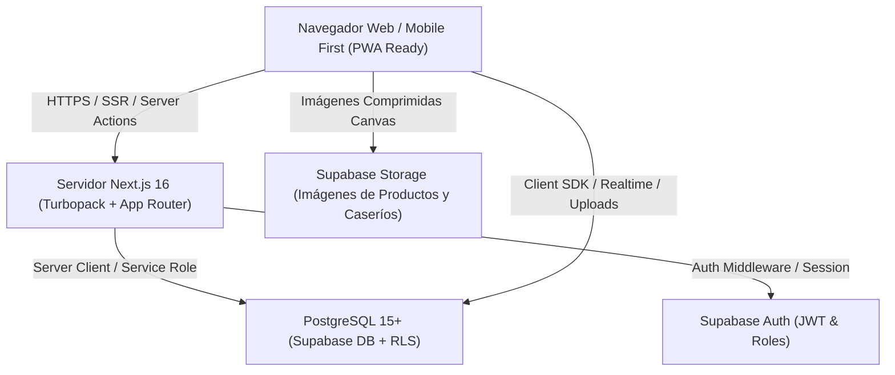
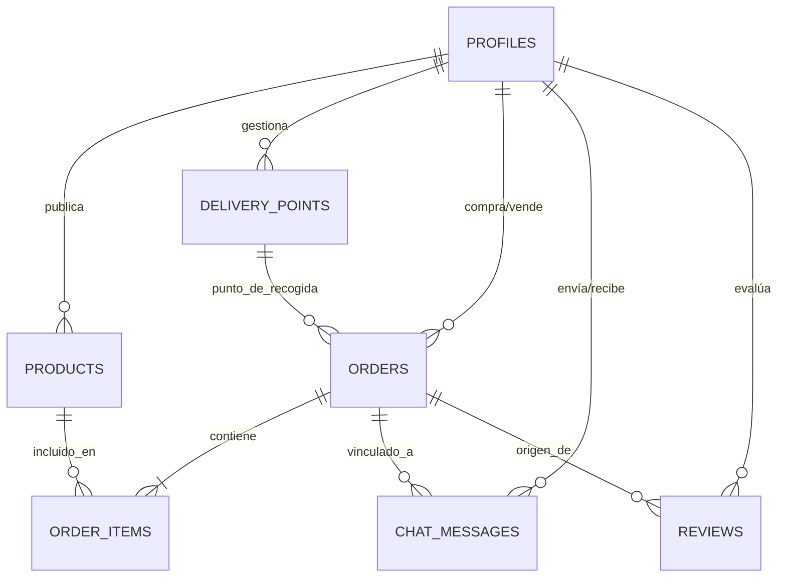
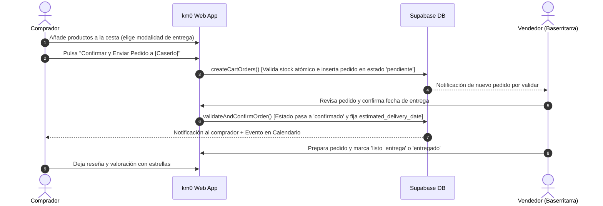

# 🌾 km0 (Caserío km0) — DOCUMENTO MAESTRO DE ESPECIFICACIÓN Y ARQUITECTURA
> **Fuente estructurada optimizada para Google NotebookLM**  
> *Diseñado para generación automática de infografías, presentaciones ejecutivas, guías funcionales, mapas conceptuales, guiones de vídeo/audio y blueprints de reutilización.*

---

## 📑 ÍNDICE GENERAL
1. **Visión General, Propuesta de Valor y Dossier Comercial (Pitch)**
2. **Arquitectura del Sistema y Stack Tecnológico**
3. **Diseño de Base de Datos y Modelo Entidad-Relación (Supabase/PostgreSQL)**
4. **Especificación de Diseño Funcional (FDS - Functional Design Specification)**
5. **Flujos Operativos y Experiencia de Usuario (User Journeys)**
6. **Guía de Explotación y Manual Operativo ("Cómo Funciona")**
7. **Guía de Reutilización y Adaptabilidad como Plantilla Base (Blueprint)**

---

# 1. VISIÓN GENERAL, PROPUESTA DE VALOR Y DOSSIER COMERCIAL

### 1.1 ¿Qué es km0?
**km0** es una plataforma digital de comercio directo (*Direct-to-Consumer / D2C*) y proximidad que conecta directamente a **productores locales (baserritarras, agricultores, ganaderos y artesanos)** con **consumidores finales (compradores particulares y familias)** sin intermediarios abusivos ni cadenas logísticas complejas.

### 1.2 Problema de Mercado
* **Márgenes asfixiantes para el productor**: Los canales tradicionales de distribución y grandes superficies retienen hasta el 70-80% del valor final del producto alimentario.
* **Falta de trazabilidad y frescura para el comprador**: Los consumidores buscan alimentos frescos, de temporada y sostenibles, pero desconocen qué caseríos tienen disponibilidad en su zona y cuándo cosechan.
* **Logística rígida**: Los pequeños productores no pueden asumir envíos masivos diarios; requieren coordinar entregas según días de cosecha, puntos físicos (mercados/plazas) o recogida directa en finca.

### 1.3 Solución y Propuesta de Valor Única (USP)
1. **Comercio 100% Directo**: Trato personal y directo entre cliente y caserío mediante chat integrado y perfiles de transparencia.
2. **Cesta Multivendedor con Tramitación Individual**: Un comprador puede llenar su cesta con productos de múltiples caseríos distintos y confirmar/pagar el pedido de cada caserío de forma independiente.
3. **Gestión Flexible de Modalidades de Entrega**:
   - 🏡 **Recogida en Caserío / Finca** (sin costes logísticos).
   - 📍 **Punto de Entrega Acordado** (mercado semanal, plaza, puesto físico).
   - 🚚 **Envío a Domicilio** (con desglose detallado de dirección y notas al repartidor).
4. **Calendario Logístico Dinámico**: Estimaciones de entrega inteligentes basadas en limitaciones de cosecha, disponibilidad inmediata o días concretos de mercado.
5. **Control Automático de Stock Atómico**: Mecanismo de reserva de inventario mediante funciones RPC en PostgreSQL con soporte para productos a granel (kg) y por unidades/packs.

### 1.4 Modelo de Negocio y Monetización
* **Comisión por Transacción (Take Rate)**: Pequeña comisión porcentual sobre pedidos confirmados.
* **Modelo SaaS / Suscripción para Productores**: Cuota mensual o anual para caseríos con herramientas avanzadas de analítica, destacados y gestión de múltiples puntos de venta.
* **Servicios Premium para Compradores**: Pedidos recurrentes programados, alertas de cosecha temprana y suscripciones a cajas de temporada.

---

# 2. ARQUITECTURA DEL SISTEMA Y STACK TECNOLÓGICO



### 2.1 Componentes del Stack
* **Frontend**: Next.js 16 (App Router), React 19, TypeScript 5.
* **Estilos y UI**: Tailwind CSS v4, Lucide React (optimizado mediante `@optimizePackageImports`).
* **Backend y API**: Next.js Server Actions (`'use server'`) con validación atómica y revalidación de caché (`revalidatePath`).
* **Base de Datos & Auth**: Supabase (PostgreSQL 15+), Row Level Security (RLS), Triggers PL/pgSQL y Funciones `SECURITY DEFINER`.
* **Caché y Optimización en Cliente**: `useMemo`, `useSyncExternalStore` con eventos reactivos personalizados (`km0_favorites_updated`), compresión Canvas JPEG/WebP en subida.

---

# 3. DISEÑO DE BASE DE DATOS Y MODELO ENTIDAD-RELACIÓN



### 3.1 Tablas y Especificación de Campos

#### 1. `profiles` (Perfiles de Usuario)
| Campo | Tipo | Restricciones | Descripción |
| :--- | :--- | :--- | :--- |
| `id` | `UUID` | `PK, FK auth.users(id) ON DELETE CASCADE` | ID único vinculado a autenticación |
| `role` | `TEXT` | `DEFAULT 'comprador'` | Rol del usuario: `'comprador'`, `'vendedor'`, `'admin'` |
| `full_name` | `TEXT` | `NOT NULL` | Nombre completo o nombre del Caserío |
| `phone` | `TEXT` | `NULLABLE` | Teléfono de contacto directo |
| `address` | `TEXT` | `NULLABLE` | Dirección fiscal / ubicación física |
| `town` | `TEXT` | `NOT NULL` | Municipio / Pueblo (e.g. Gernika, Dima, Tolosa) |
| `avatar_url` | `TEXT` | `NULLABLE` | URL o base64 de la foto de perfil o logo del caserío |
| `bio` | `TEXT` | `NULLABLE` | Descripción del caserío, métodos de cultivo, historia |
| `seller_status`| `TEXT` | `DEFAULT 'approved'` | Estado de moderación: `'pending'`, `'approved'`, `'rejected'` |
| `saved_addresses`| `JSONB` | `DEFAULT '[]'` | Array de direcciones favoritas del comprador |
| `created_at` | `TIMESTAMPTZ`| `DEFAULT NOW()` | Fecha de registro |
| `updated_at` | `TIMESTAMPTZ`| `DEFAULT NOW()` | Última actualización del perfil |

#### 2. `products` (Catálogo de Productos)
| Campo | Tipo | Restricciones | Descripción |
| :--- | :--- | :--- | :--- |
| `id` | `UUID` | `PK, DEFAULT gen_random_uuid()` | Identificador único del producto |
| `seller_id` | `UUID` | `FK profiles(id) ON DELETE CASCADE` | Vendedor propietario |
| `name` | `TEXT` | `NOT NULL` | Nombre del producto (e.g., Tomate Jack) |
| `description` | `TEXT` | `NULLABLE` | Descripción detallada y notas de sabor |
| `category` | `TEXT` | `NOT NULL` | Categoría: `verduras_hortalizas`, `frutas`, `quesos_lacteos`, `bebidas`, `otros_alimentos`, `plantas_flores`, `artesania` |
| `format` | `TEXT` | `DEFAULT 'suelto'` | Formato de venta: `'granel'` (kg), `'suelto'` (unidad/pieza), `'pack'` (cesta/lote) |
| `price` | `NUMERIC` | `NOT NULL, DEFAULT 0` | Precio base o precio unitario (€) |
| `price_per_kilo`| `NUMERIC` | `NULLABLE` | Precio por kilogramo en formato granel |
| `weight_kg` | `NUMERIC` | `NULLABLE` | Peso unitario estimado en kg |
| `stock` | `NUMERIC` | `DEFAULT 10` | Cantidad disponible en inventario |
| `is_unlimited_stock` | `BOOLEAN` | `DEFAULT FALSE` | `true` si el stock es ilimitado/continuo |
| `is_organic` | `BOOLEAN` | `DEFAULT FALSE` | Certificación ecológica |
| `cultivation` | `TEXT` | `DEFAULT 'no_aplica'` | `'exterior'`, `'invernadero'`, `'no_aplica'` |
| `image_url` | `TEXT` | `NULLABLE` | Imagen del producto |
| `availability_type` | `TEXT` | `DEFAULT 'inmediato'`| Disponibilidad: `'inmediato'`, `'dias'`, `'dias_semana'`, `'fecha_concreta'` |
| `availability_days` | `INTEGER` | `DEFAULT 1` | Días de preparación si `availability_type = 'dias'` |
| `availability_weekdays`| `TEXT[]` | `NULLABLE` | Días de la semana disponibles (e.g. `['lunes', 'viernes']`) |
| `available_from_date` | `DATE` | `NULLABLE` | Fecha de inicio de cosecha |
| `delivery_methods` | `TEXT[]` | `DEFAULT ARRAY['caserio','punto_entrega','domicilio']` | Modalidades de entrega habilitadas por el vendedor para este producto |
| `is_active` | `BOOLEAN` | `DEFAULT TRUE` | `true` visible en catálogo, `false` pausado |

#### 3. `delivery_points` (Puntos de Entrega Físicos y Ubicaciones)
| Campo | Tipo | Restricciones | Descripción |
| :--- | :--- | :--- | :--- |
| `id` | `UUID` | `PK, DEFAULT gen_random_uuid()` | Identificador único del punto |
| `seller_id` | `UUID` | `FK profiles(id) ON DELETE CASCADE` | Vendedor titular |
| `name` | `TEXT` | `NOT NULL` | Nombre (e.g., Mercado de La Ribera, Plaza Mayor) |
| `type` | `TEXT` | `DEFAULT 'sitio_fisico'` | `'sitio_fisico'` o `'caserio'` |
| `town` | `TEXT` | `NOT NULL` | Municipio del punto |
| `postal_code` | `TEXT` | `NULLABLE` | Código Postal |
| `address_details`| `TEXT` | `NOT NULL` | Dirección exacta, puesto o indicaciones |
| `days_of_week` | `TEXT[]` | `NULLABLE` | Días de apertura (e.g. `['sabado']`) |
| `opening_time` | `TEXT` | `NULLABLE` | Hora de apertura (e.g. `08:30`) |
| `closing_time` | `TEXT` | `NULLABLE` | Hora de cierre (e.g. `14:00`) |
| `image_url` | `TEXT` | `NULLABLE` | Foto del puesto o caserío |
| `is_active` | `BOOLEAN` | `DEFAULT TRUE` | Estado activo |

#### 4. `orders` (Pedidos)
| Campo | Tipo | Restricciones | Descripción |
| :--- | :--- | :--- | :--- |
| `id` | `UUID` | `PK, DEFAULT gen_random_uuid()` | Identificador único del pedido |
| `buyer_id` | `UUID` | `FK profiles(id) ON DELETE CASCADE` | Comprador |
| `seller_id` | `UUID` | `FK profiles(id) ON DELETE CASCADE` | Vendedor/Caserío receptor |
| `delivery_point_id` | `UUID` | `FK delivery_points(id) ON DELETE SET NULL` | Punto de entrega seleccionado (si aplica) |
| `shipping_address` | `TEXT` | `NULLABLE` | Dirección completa de entrega a domicilio |
| `status` | `TEXT` | `DEFAULT 'pendiente'` | Estados: `'pendiente'`, `'confirmado'`, `'preparando'`, `'listo_entrega'`, `'entregado'`, `'cancelado'` |
| `total_amount` | `NUMERIC` | `NOT NULL, DEFAULT 0` | Importe total (€) |
| `estimated_delivery_date`| `TIMESTAMPTZ`| `NULLABLE` | Fecha estimada o confirmada de entrega |
| `rejection_reason` | `TEXT` | `NULLABLE` | Motivo de rechazo o cancelación |

#### 5. `order_items` (Líneas de Pedido)
| Campo | Tipo | Restricciones | Descripción |
| :--- | :--- | :--- | :--- |
| `id` | `UUID` | `PK, DEFAULT gen_random_uuid()` | Identificador de línea |
| `order_id` | `UUID` | `FK orders(id) ON DELETE CASCADE` | Pedido al que pertenece |
| `product_id` | `UUID` | `FK products(id) ON DELETE SET NULL` | Producto adquirido |
| `quantity` | `NUMERIC` | `NOT NULL, DEFAULT 1` | Cantidad (kg o unidades) |
| `unit_price` | `NUMERIC` | `NOT NULL` | Precio unitario fijado en el momento de la compra |
| `subtotal` | `NUMERIC` | `NOT NULL` | `quantity * unit_price` |

#### 6. `chat_messages` (Mensajería Instantánea)
| Campo | Tipo | Restricciones | Descripción |
| :--- | :--- | :--- | :--- |
| `id` | `UUID` | `PK, DEFAULT gen_random_uuid()` | Identificador del mensaje |
| `sender_id` | `UUID` | `FK profiles(id) ON DELETE CASCADE` | Emisor |
| `receiver_id` | `UUID` | `FK profiles(id) ON DELETE CASCADE` | Receptor |
| `order_id` | `UUID` | `FK orders(id) ON DELETE SET NULL` | Pedido asociado (opcional) |
| `message` | `TEXT` | `NOT NULL` | Contenido del mensaje |
| `is_read` | `BOOLEAN` | `DEFAULT FALSE` | Estado de lectura |
| `created_at` | `TIMESTAMPTZ`| `DEFAULT NOW()` | Timestamp de envío |

#### 7. `reviews` (Valoraciones y Reseñas)
| Campo | Tipo | Restricciones | Descripción |
| :--- | :--- | :--- | :--- |
| `id` | `UUID` | `PK, DEFAULT gen_random_uuid()` | Identificador |
| `order_id` | `UUID` | `FK orders(id) ON DELETE SET NULL` | Pedido verificado que origina la valoración |
| `reviewer_id` | `UUID` | `FK profiles(id) ON DELETE CASCADE` | Autor |
| `target_id` | `UUID` | `FK profiles(id) ON DELETE CASCADE` | Caserío evaluado |
| `rating` | `INTEGER` | `CHECK (rating BETWEEN 1 AND 5)` | Puntuación de 1 a 5 estrellas |
| `comment` | `TEXT` | `NULLABLE` | Comentario |
| `is_anonymous` | `BOOLEAN` | `DEFAULT FALSE` | Publicar anónimamente |

---

# 4. ESPECIFICACIÓN DE DISEÑO FUNCIONAL (FDS)

### 4.1 Roles y Permisos
1. **Comprador (`comprador`)**:
   - Explorar catálogo con filtros (Categoría, Pueblo, Caserío, Disponibilidad, Certificación Ecológica).
   - Añadir productos a la cesta con selección interactiva de modalidad de entrega y cálculo de fecha estimada de cosecha.
   - Gestionar direcciones favoritas con 9 campos estructurados.
   - Tramitar pedidos individualmente por cada vendedor.
   - Chatear en tiempo real con los productores.
   - Ver sus compras en lista cronológica y en **Calendario Logístico**.
   - Valorar pedidos entregados.
2. **Vendedor / Productor (`vendedor`)**:
   - Gestionar catálogo (crear, editar, pausar, fijar precios por kg o unidad, configurar días de cosecha y modalidades de entrega).
   - Administrar **Puntos de Entrega Físicos y Caseríos** con fotos y horarios.
   - Bandeja de entrada de **Validación de Pedidos**: Aceptar confirmando fecha exacta de entrega o rechazar con motivo.
   - **Calendario del Vendedor**: Vista mensual/semanal con desglose de entregas por punto, caserío o domicilio.
3. **Administrador (`admin`)**:
   - Moderación de usuarios y validación de altas de nuevos productores.
   - Métricas globales de plataforma y resolución de incidencias.

### 4.2 Lógica de la Cesta y Checkout Individual
```
[Cesta del Comprador]
   │
   ├── [Bloque Caserío 1 (e.g., Baserria Goiko)]
   │     ├── Producto A (2 kg Tomates) -> [Modalidad: Recogida Caserío]
   │     ├── Producto B (1 ud Queso)   -> [Modalidad: Recogida Caserío]
   │     ├── [Chat Directo con Caserío 1]
   │     └── [BOTÓN: Confirmar y Enviar Pedido a Baserria Goiko (14.50 €)]
   │
   └── [Bloque Caserío 2 (e.g., Huerta Arrieta)]
         ├── Producto C (3 kg Manzanas) -> [Modalidad: Envío Domicilio]
         │     └── Campos: Nombre, Apellidos, Calle, Nº, Piso, Puerta, CP, Población, Provincia
         ├── [Chat Directo con Caserío 2]
         └── [BOTÓN: Confirmar y Enviar Pedido a Huerta Arrieta (8.20 €)]
```
* Cada caserío tiene su propia validación y flujo independiente.
* Al tramitar el pedido de un caserío, solo se descuentan sus productos de la cesta, manteniendo los demás caseríos intactos para tramitar cuando el usuario lo decida.

---

# 5. FLUJOS OPERATIVOS Y EXPERIENCIA DE USUARIO



---

# 6. GUÍA DE EXPLOTACIÓN Y MANUAL OPERATIVO

### 6.1 Cómo Añadir un Producto como Productor
1. Acceder a **Mi Cuenta** -> **Publicar Producto**.
2. Rellenar nombre, categoría y formato (**A granel por kg** o **Por unidad / pack**).
3. Seleccionar modalidades de entrega disponibles para este producto (Caserío, Puntos de Entrega o Domicilio).
4. Configurar disponibilidad de cosecha: Inmediata, Días de preparación, Días de la semana específicos o Fecha concreta.
5. Subir imagen (se comprime automáticamente a <150 KB).

### 6.2 Cómo Gestionar Puntos de Entrega
1. Acceder a **Puntos de Entrega**.
2. Crear un nuevo punto (Puesto en Mercado, Plaza, Finca).
3. Asignar nombre, municipio, dirección exacta, horario de apertura/cierre y foto del puesto.
4. Quedará disponible al instante en el selector de la cesta para los compradores.

---

# 7. GUÍA DE REUTILIZACIÓN COMO PLANTILLA BASE (BLUEPRINT)

Esta arquitectura está desacoplada y preparada para ser clonada y adaptada a cualquier vertical de **comercio local multivendedor**:

| Caso de Uso | Adaptación de Categorías | Modalidades de Entrega Recomendadas |
| :--- | :--- | :--- |
| **km0 Pesca y Cofradías** | Pescado blanco, azul, marisco, conservas | Recogida en Puerto / Lonja, Entrega Domicilio |
| **Marketplace de Artesanía** | Cerámica, textil, madera, joyería, cuero | Taller del artesano, Puntos feria, Envío postal |
| **Comercio de Barrio / Gremios** | Panaderías, carnicerías, floristerías locales | Recogida en tienda, Reparto en bicicleta local |
| **Economía Circular / Reparación** | Ropa vintage, muebles restaurados, electrónica | Punto limpio municipal, Taller de reparación |

---
*Fin del Documento Maestro km0 — Listo para importar como fuente primaria en Google NotebookLM.*
